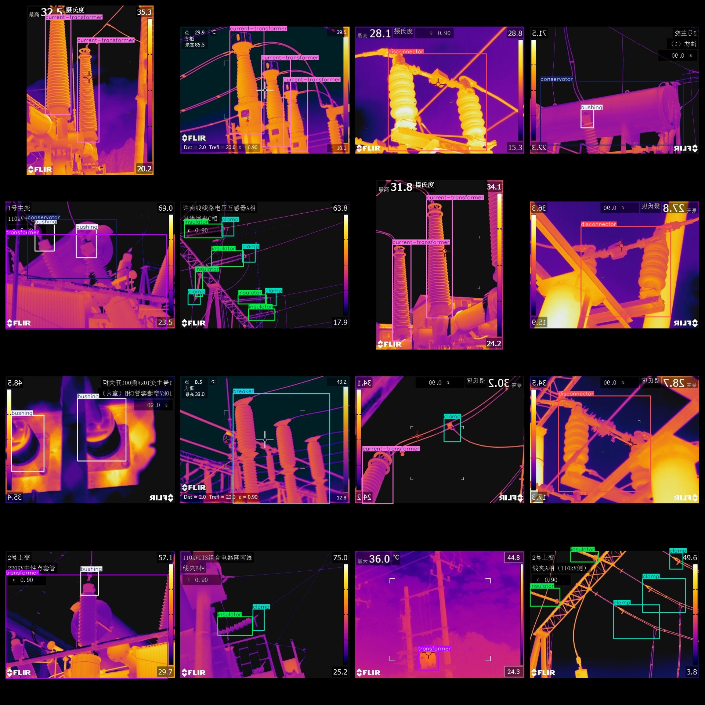
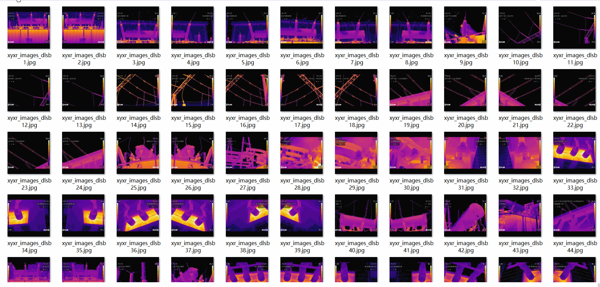

# Power Equipment Infrared Image Detection Dataset 1114 imagesVOC+YOLO format

The dataset of power equipment infrared image detection consists of 1114 images, which are in VOC+YOLO format.

Dataset format: Pascal VOC format + YOLO format (the txt file does not contain the split path, it only contains jpg images and corresponding VOC format xml files and yolo format txt files)

Number of images (Total number of jpg files): 1114

Number of annotations (number of xml files): 1114

Number of txt files: 1114

Number of categories: 10

The Github repository is: datasets_sl

["arrester", "breaker", "bushing", "clamp", "conservator", "current-transformer", "disconnector", "disconnector2", "insulator", "transformer"]

Protective device, circuit breaker, casing, wire clamp, oil storage cabinet, current transformer, isolating switch, isolating switch 2, insulator, transformer

Number of boxes labeled in each category:

arrester frame count = 242

breaker frame count = 159

Bushing frame count = 253

Clamp Frame Count = 307

conservator frame count = 56

The number of current-transformer frames is 437.

The number of disconnectors is 216.

The number of disconnectors is 152.

The insulator's frame count is 783.

Transformer Layer Count = 89

Total frame count: 2694

Number of images per category:

Number of arrester pictures = 112

Number of photos owned by breaker = 149

Number of bushing images = 130

Clamp the number of images = 163

Conservator's occupancy count = 56

The number of images occupied by the current-transformer is 210.

Disconnector has 206 images.

Disconnector2 occupies a picture count of 98.

【】『』"insulator" has 256 pictures

Transformers hold 88 pictures.

Image resolution: 640x640

Use the labeling tool: labelImg

Dataset Augmentation: Yes

Rules for annotation: Draw a rectangle around the category.

Important note: The dataset does not have been divided into training, validation, and testing sets.

Special Disclaimer: This dataset does not guarantee the accuracy of the trained models or weight files.

Annotation and image details are as follows:

## Images

---

Here is a pay link on Stripe (https://buy.stripe.com/3cs8yP7sY87d0vu9AB). Please contact me lonlonago@foxmail.com after funding $89, and I will send you a complete data files, thank you!

